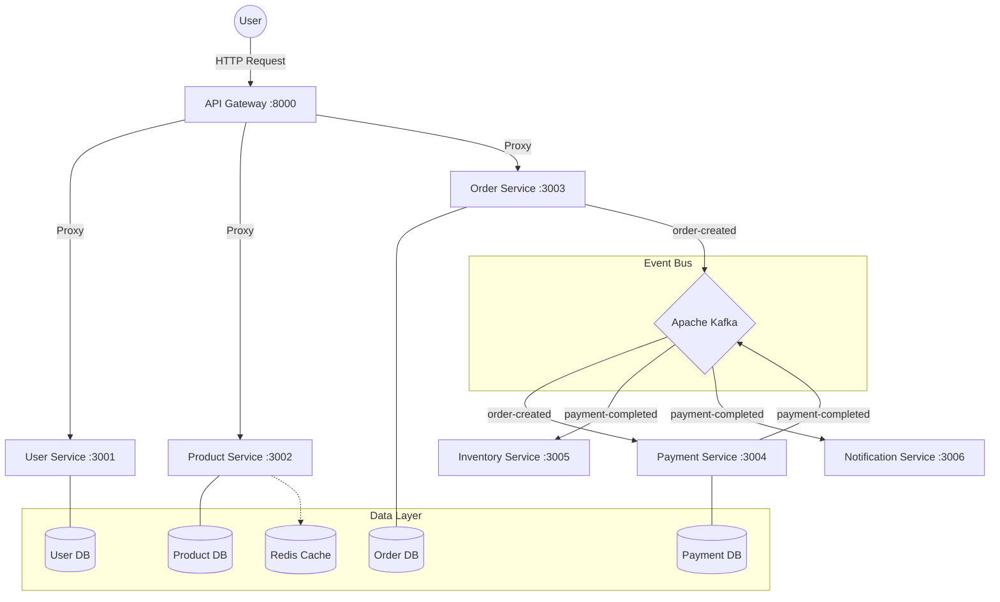

# CommerceX – Event-Driven Microservices Platform

**CommerceX** is a scalable, event-driven e-commerce backend built with **Node.js**, **Express**, **Kafka**, **MongoDB**, and **Redis**. It demonstrates a modern microservices architecture where services communicate asynchronously via events.

---

## 🎯 Design Principles

CommerceX follows production-grade backend architecture principles:

- **Database-per-Service Pattern**: Each microservice owns its data store to ensure isolation and independent scalability.
- **Event-Driven Architecture**: Services communicate asynchronously via Kafka to reduce coupling.
- **Stateless Services**: All services are horizontally scalable.
- **Read-Aside Caching Pattern**: Redis improves read performance for high-traffic endpoints.
- **Fault Isolation**: Failure in one service does not cascade across the system.

---

## 📚 Documentation
- [**API Reference**](docs/API.md): Detailed API endpoints and examples.
- [**Event Schema**](docs/EVENTS.md): Kafka topics and event payload specifications.
- [**System Architecture**](docs/ARCHITECTURE.md): Deep dive into design patterns and components.
- [**Testing Guide**](docs/TESTING.md): Comprehensive testing strategy and verification steps.

---

## 🏗️ Architecture Diagram



---

## ⚡ Why Apache Kafka?

Kafka is used to enable asynchronous communication between services.

Instead of tightly coupling services via REST calls:
> `Order` → `Payment` → `Inventory` → `Notification`

CommerceX uses event-based communication:
> `Order` → **Kafka** → `Payment` → **Kafka** → `Inventory` + `Notification`

This provides:
- **Loose coupling**
- **Fault tolerance**
- **Scalability**
- **Event replay capability**
- **High throughput processing**

## 📈 Scalability Strategy

CommerceX is designed for horizontal scalability:

- **Stateless service containers**
- **Kafka consumer groups** for parallel processing
- **MongoDB indexing** for optimized queries
- **Redis caching** to reduce database load
- **Docker-based deployment** for container orchestration readiness

The system is Kubernetes-ready and supports independent service scaling.

## � Failure Handling Strategy

- **Kafka retains unprocessed events** until consumed.
- If a consumer crashes, it **resumes from last committed offset**.
- **Services are isolated** to prevent cascading failures.
- **Database failures** impact only the owning service.

---

## �🚀 Services

| Service | Port | Database | Responsibilities |
| :--- | :--- | :--- | :--- |
| **API Gateway** | `8000` | N/A | Central entry point, request routing. |
| **User Service** | `3001` | MongoDB | User auth (JWT), profile management. |
| **Product Service** | `3002` | MongoDB, Redis | Product CRUD, Read-Aside Caching. |
| **Order Service** | `3003` | MongoDB | Order placement, Event Producer. |
| **Payment Service** | `3004` | MongoDB | Payment processing, Event Consumer/Producer. |
| **Inventory Service** | `3005` | N/A (Simulated) | Stock management, Event Consumer. |
| **Notification Service** | `3006` | N/A (Simulated) | Email notifications, Event Consumer. |

---

## 🛠️ Prerequisites

- **Node.js** (v18+)
- **Docker** & **Docker Compose**
- **Git**

---

## 🏁 Getting Started

### 1. Clone & Setup
```bash
git clone https://github.com/jenilrupapara001/commercex-event-driven-microservices.git
cd commercex-event-driven-microservices
```

### 2. Start Infrastructure
Run the following command to start **Zookeeper**, **Kafka**, **Redis**, and **MongoDB**:
```bash
docker-compose up -d
```
*Wait for a minute to ensure Kafka and Zookeeper perform their handshake.*

### 3. Install Dependencies & Start Services
You can run each service in a separate terminal.

**User Service:**
```bash
cd user-service && npm install && npm start
```

**Product Service:**
```bash
cd product-service && npm install && npm start
```

**Order Service:**
```bash
cd order-service && npm install && npm start
```

**Payment Service:**
```bash
cd payment-service && npm install && npm start
```

**Inventory Service:**
```bash
cd inventory-service && npm install && npm start
```

**Notification Service:**
```bash
cd notification-service && npm install && npm start
```

**API Gateway:**
```bash
cd api-gateway && npm install && npm start
```

---

## 🧪 Verification

We have included a comprehensive verification walkthrough.

1.  **Check Health**:
    ```bash
    curl http://localhost:3001/health
    # Response: {"status":"UP","service":"user-service","db":"CONNECTED"}
    ```

2.  **Test Full Flow**:
    Create an order and watch the logs of Payment, Inventory, and Notification services.
    ```bash
    curl -X POST http://localhost:3003/orders \
      -H "Content-Type: application/json" \
      -d '{"user":"<USER_ID>","items":[{"product":"<PRODUCT_ID>","quantity":1,"price":100}],"totalAmount":100}'
    ```

---

## 🔒 Security & Observability

- **Rate Limiting**: All services currently limited to 100 requests / 15 mins.
- **Security Headers**: `Helmet` is enabled on all services.
- **Logging**: Structured JSON logging via `Winston` (Method, URL, Status, Duration).

---

## 🧠 What This Project Demonstrates

CommerceX showcases:

- **Event-driven microservices architecture**
- **Distributed systems design**
- **Asynchronous inter-service communication**
- **Database-per-service implementation**
- **Caching strategies**
- **Containerized deployment**
- **Production-grade backend structuring**

This project is intended to simulate enterprise-level backend architecture.

---

## 📜 License

MIT
